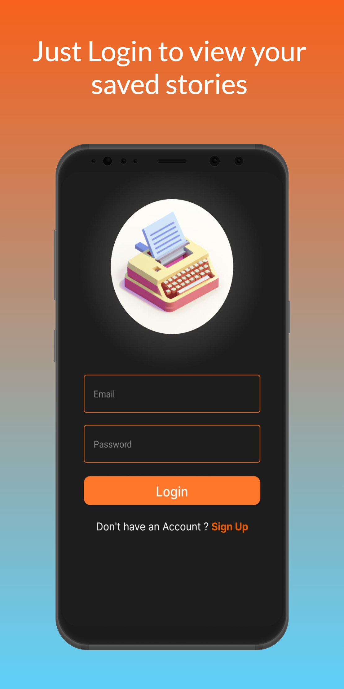
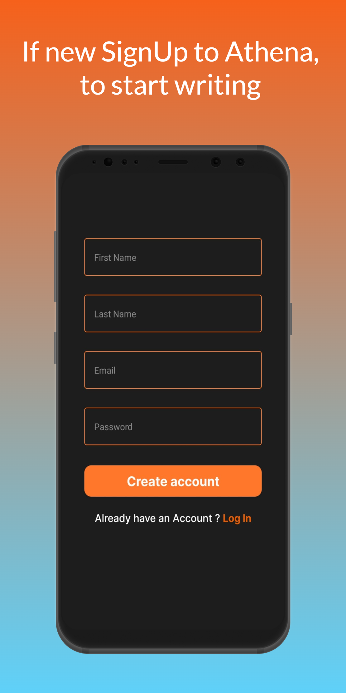
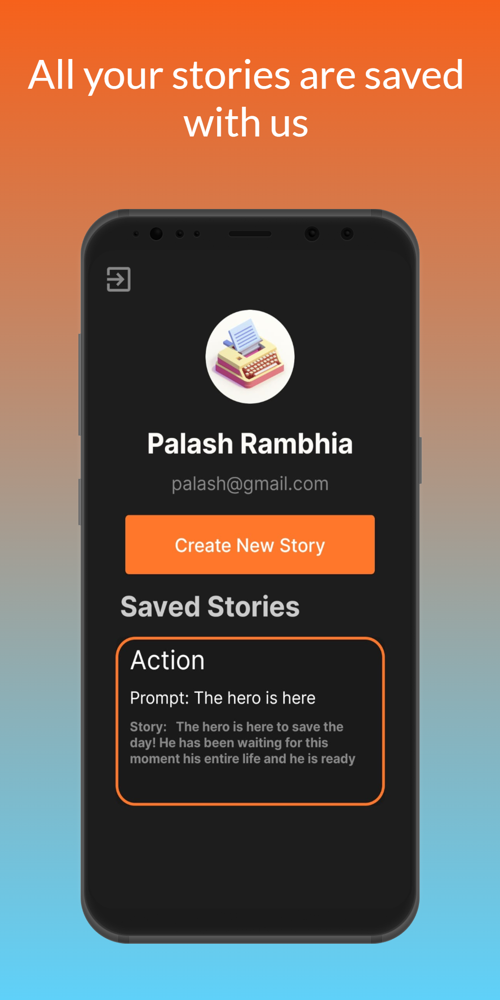
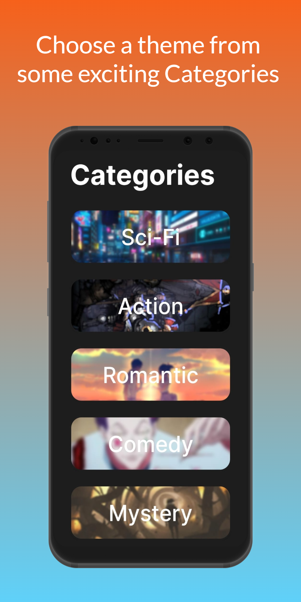
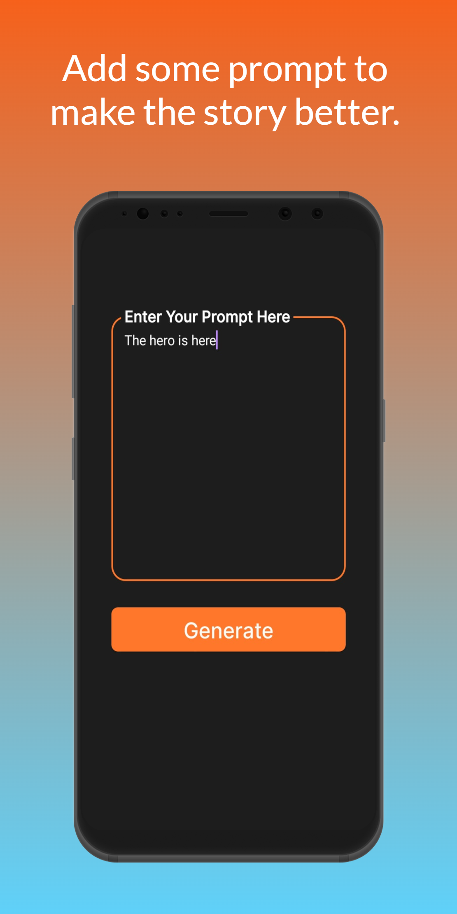
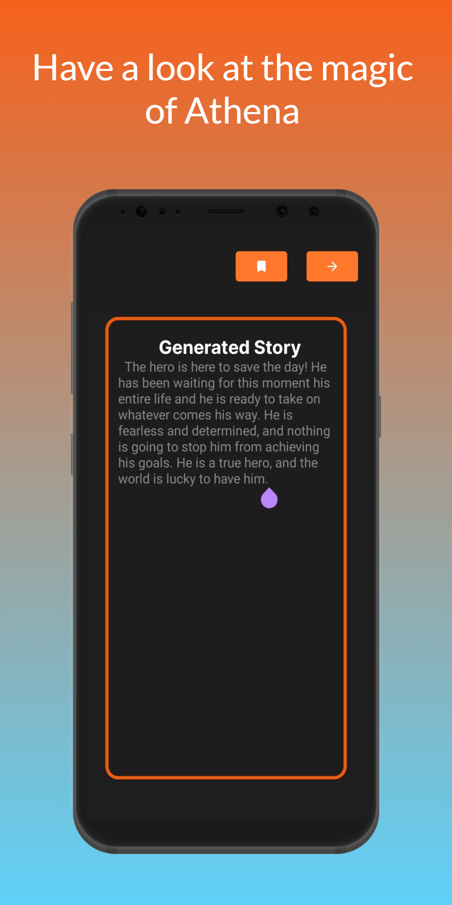

# Athena

### Problem Statement:
Every writer's first challenge is coming up with an idea for a story and getting it off the ground. The first part is crucial because it is what captures the audience's attention. As a result, working on the first section becomes challenging, and many writers may become demotivated if a good start is not made. Additionally, writers frequently run out of ideas mid-story and are unable to come up with fresh ones. Because of this, many writers simply begin a new story rather than finish an excellent story.

### Proposed Solution:
A short story writing app called Athena gives users a head start by generating a story between 100 and 200 words long based on their preferences. The user only needs to pick a genre for their narrative and create a brief prompt before they are ready to commence. This short story provides writers with clear instructions, which makes their work easier. Both authors in need of new inspiration and those who are stuck in the middle of their story might benefit from using this app.

### Application Images:  
                                                                              

### Functionality & Concepts used:
The App has a very simple and interactive interface that helps the user to QUIT SMOKING and Live a better life.
Following are a few android concepts used to achieve the functionalities in the app:

  1. Constraint Layout: Most of the activities in the app uses a flexible constraint layout, which is easy to handle for different screen sizes.
  2. Simple & Easy Views Design: Use of familiar audience EditText with hints and interactive buttons made it easier for Users to register or sign in without 
  providing any detailed instructions pages. Apps also use App Navigation to switch between screens of Progress, Rewards and Tips.
  3. Recycler-View:  To present the Quotes and display the Goals of Users. 
  4. LiveData & Room Database: We are also using LiveData to update the status of goal acheived by user, user information, money added to the wallet in the app, etc. 
  The User Can Update their personal information, add funds to their wallet, and set different goals.

